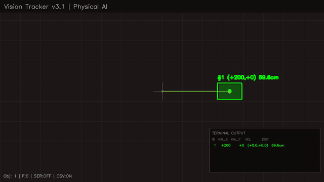
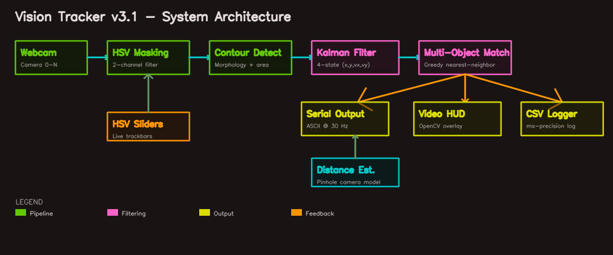

# Vision Tracker

[](https://github.com/NeuralNomad7/vision-tracker/actions/workflows/ci.yml)
[](https://www.python.org/downloads/)
[](LICENSE)

Real-time robotic perception system with **three interchangeable detection backends** — color-blob (HSV), deep-learning (YOLOv8), and fiducial markers (ArUco 6-DoF pose). Streams Kalman-filtered target vectors to a robot controller over serial. Built with OpenCV and hardened for production use.



## Features

- **Three detection backends** — HSV color blobs, YOLOv8 (80 COCO classes), ArUco markers with 6-DoF pose
- **Kalman-filtered tracking** — 4-state filter (position + velocity) for smooth, predictive tracking
- **Multi-object tracking** — up to 10 objects with persistent IDs (ArUco IDs are marker-derived)
- **Serial robot output** — target vectors streamed to a microcontroller at 30 Hz
- **CSV data logging** — millisecond-precision logs with Kalman state, raw measurements, velocity, distance
- **Persistent HSV calibration** — slider values auto-save on exit and reload on next run
- **6-DoF pose estimation** — ArUco mode outputs metric depth (meters) via `solvePnP` with camera intrinsics
- **Live HSV calibration sliders** — tune color detection to any lighting condition
- **Distance estimation** — pinhole model (HSV/YOLO) or tvec metric depth (ArUco)
- **Production-hardened** — graceful signal handling, input validation, serial disconnect recovery

## Architecture



## Quick Start

### Install

```bash
git clone https://github.com/NeuralNomad7/vision-tracker.git
cd vision-tracker
python -m venv venv
source venv/bin/activate   # Windows: venv\Scripts\activate
pip install -r requirements.txt

# Optional: enable YOLO backend (~2GB torch download)
pip install ultralytics
```

### Run

```bash
# HSV color-blob (default — works out of the box, tune via sliders)
python vision_tracker.py

# YOLOv8 — detect any of 80 COCO classes (auto-downloads yolov8n.pt)
python vision_tracker.py --detector yolo
python vision_tracker.py --detector yolo --yolo-classes person,cup,bottle
python vision_tracker.py --detector yolo --yolo-conf 0.5

# ArUco fiducial markers with 6-DoF pose
python vision_tracker.py --detector aruco --marker-size 0.05
python vision_tracker.py --detector aruco --intrinsics cam.json

# Serial robot output + CSV
python vision_tracker.py --detector yolo --serial COM3 --csv-auto

# List available serial ports
python vision_tracker.py --list-ports
```

### CLI Reference

| Flag | Description | Default |
|------|-------------|---------|
| `--detector {hsv,yolo,aruco}` | Detection backend | `hsv` |
| `--serial PORT` | Serial port for robot output | None |
| `--baud RATE` | Serial baud rate | `115200` |
| `--list-ports` | List serial ports and exit | — |
| `--csv FILE` | CSV log output path (under cwd) | None |
| `--csv-auto` | Auto-generate timestamped CSV in `./logs/` | Off |
| `--camera N` | Camera index | `0` |
| `--verbose, -v` | DEBUG-level logging | Off |
| `--yolo-model PATH` | YOLO weights (pt/onnx) | `yolov8n.pt` |
| `--yolo-conf FLOAT` | YOLO confidence threshold | `0.4` |
| `--yolo-classes STR` | Comma-separated class filter | all |
| `--aruco-dict STR` | ArUco dictionary name | `DICT_4X4_50` |
| `--marker-size M` | ArUco marker edge length (meters) | `0.05` |
| `--intrinsics JSON` | Camera intrinsics file | synthesized |
| `--calib PATH` | HSV calibration JSON path | `calibration.json` |
| `--no-save-calib` | Do not persist HSV sliders | Off |

### Keyboard Shortcuts

| Key | Action |
|-----|--------|
| `q` | Quit |
| `m` | Toggle mask view (HSV mode only) |
| `r` | Reset object IDs |
| `s` | List serial ports in terminal |
| `c` | Save HSV calibration now (HSV mode) |

## Detection Backends

### HSV (color blob)
Fast, zero-dependency, ideal for brightly colored targets under controlled lighting. Tune the two HSV channels via the **HSV Calibration** window sliders. Slider values persist to `calibration.json` on exit.

### YOLOv8 (deep learning)
Detects any of the 80 COCO classes (person, cup, bottle, chair, laptop, …). Requires `ultralytics`. First run auto-downloads `yolov8n.pt` (~6 MB). Use `--yolo-classes` to filter; use a custom `.pt` / `.onnx` via `--yolo-model`.

### ArUco (fiducial pose)
Detects printed ArUco markers and estimates full 6-DoF pose (position + orientation). Object IDs are the marker IDs themselves — stable and repeatable. The HUD draws the marker's 3D coordinate axes. Metric depth (z in meters) is extracted from the translation vector.

Generate printable markers with OpenCV:
```python
import cv2
dictionary = cv2.aruco.getPredefinedDictionary(cv2.aruco.DICT_4X4_50)
img = cv2.aruco.generateImageMarker(dictionary, 0, 400)  # marker id=0
cv2.imwrite("marker_0.png", img)
```

## Camera Intrinsics (for ArUco)

Without intrinsics, the tracker synthesizes a camera matrix assuming a 60° horizontal FOV — adequate for a demo but not for accurate metric pose. For production, calibrate your camera and save as `cam.json`:

```json
{
  "camera_matrix": [[580.0, 0.0, 320.0], [0.0, 580.0, 240.0], [0.0, 0.0, 1.0]],
  "dist_coeffs": [0.1, -0.2, 0.0, 0.0, 0.0]
}
```

## Serial Protocol

Target vectors are streamed as ASCII text at up to 30 Hz:

```
T<id>,<vec_x>,<vec_y>,<dist_cm>,<vel_x>,<vel_y>\n
F\n
```

| Field | Type | Description |
|-------|------|-------------|
| `id` | int | Object ID (1–9999; marker ID in ArUco mode) |
| `vec_x` | signed int | Pixels right (+) or left (−) of frame center |
| `vec_y` | signed int | Pixels up (+) or down (−) of frame center |
| `dist_cm` | float | Distance (cm); metric for ArUco, pinhole elsewhere |
| `vel_x` | float | Kalman velocity X (px/frame) |
| `vel_y` | float | Kalman velocity Y (px/frame) |

`F\n` marks end-of-frame.

## CSV Schema

| Column | Type | Description |
|--------|------|-------------|
| `timestamp` | ISO 8601 | Millisecond-precision local time |
| `epoch_ms` | int | Unix epoch in milliseconds |
| `obj_id` | int | Tracked object ID |
| `kalman_x` / `kalman_y` | int | Kalman-filtered pixel position |
| `raw_x` / `raw_y` | int | Raw measured pixel position |
| `vec_x` / `vec_y` | int | Target vector from frame center (Y-up) |
| `vel_x` / `vel_y` | float | Kalman velocity |
| `dist_cm` | float | Estimated distance |
| `bbox_w` / `bbox_h` | int | Bounding box size (px) |

## Calibration

### Distance Estimation (HSV / YOLO)

The tracker uses a pinhole camera model. To calibrate:

1. Hold a known object (e.g., 7.6 cm sticky note) at a known distance (e.g., 50 cm)
2. Note the object's pixel width in the bounding box
3. Calculate: `focal_length = (pixel_width * distance_cm) / real_width_cm`
4. Update `FOCAL_LENGTH_PX` and `KNOWN_WIDTH_CM` at the top of `vision_tracker.py`

ArUco mode bypasses this — it uses metric `tvec[2]` from `solvePnP`.

### HSV Color Tuning

1. Run `python vision_tracker.py` — the **HSV Calibration** window opens
2. Press `m` to toggle the binary mask view
3. Adjust G (green) and P (pink) sliders until only your target is white
4. Press `c` or quit (`q`) — slider state is saved to `calibration.json` and auto-reloaded next run

## Project Structure

```
vision-tracker/
├── .github/workflows/ci.yml   # GitHub Actions CI pipeline
├── assets/                     # Demo visuals for README
├── logs/                       # CSV tracking logs (gitignored)
├── calibration.json            # Persisted HSV sliders (gitignored, auto-created)
├── generate_demo.py            # Script to regenerate demo assets
├── vision_tracker.py           # Main application (HSV/YOLO/ArUco)
├── requirements.txt            # Pinned dependencies (YOLO optional)
├── setup.cfg                   # Flake8 linting configuration
├── LICENSE                     # MIT License
└── README.md
```

## Contributing

1. Fork the repo
2. Create a feature branch (`git checkout -b feature/my-feature`)
3. Make changes and ensure `flake8 vision_tracker.py` passes
4. Commit and push
5. Open a Pull Request

## License

[MIT](LICENSE)
